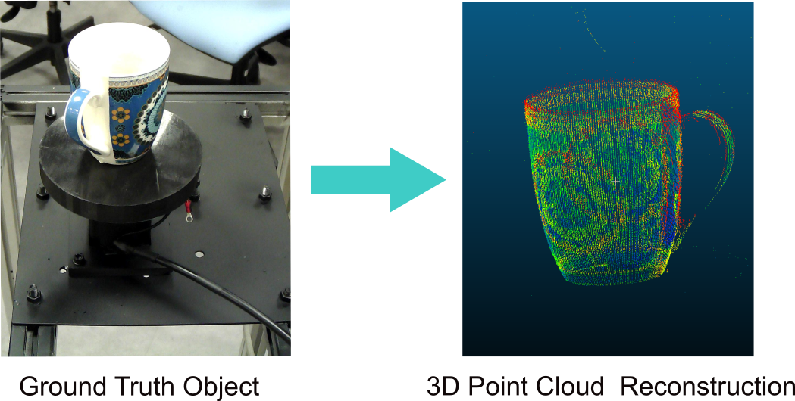

# 3D-Object-Reconstruction-Using-Robotic-Arm-Based-Stereo-Vision
Designed and implemented a calibrated laser-vision 3D reconstruction by incorporating camera calibration, image undistortion, sub-pixel laser-stripe extraction, and homography-based surface mapping. 
Generated accurate, metrically scaled colored point-cloud models by transforming sequential laser-line scans into 3D geometry and integrating RGB information from corresponding images.

This is the result of the reconstruction experiment:

